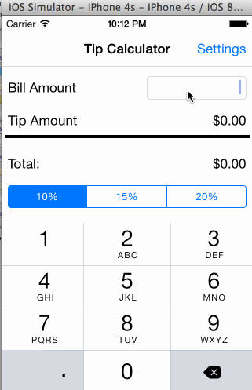

# Simple Tip Calculator demo

This is an IOS demo application for calculating tips

Time spent: 6 hours spent in total

Completed user stories:

 * [x] Required: User can calculate tips and total amount based on one of the 3 percents
 * [x] Required: User can set a default tip using the settings, default is effective when app is started
    
    Notes:

    Spent some time following the instructions with XCode 6 and understanding how the view controller and view are tied together

    Walkthrough of all user stories:

    

    GIF created with [LiceCap](http://www.cockos.com/licecap/).

